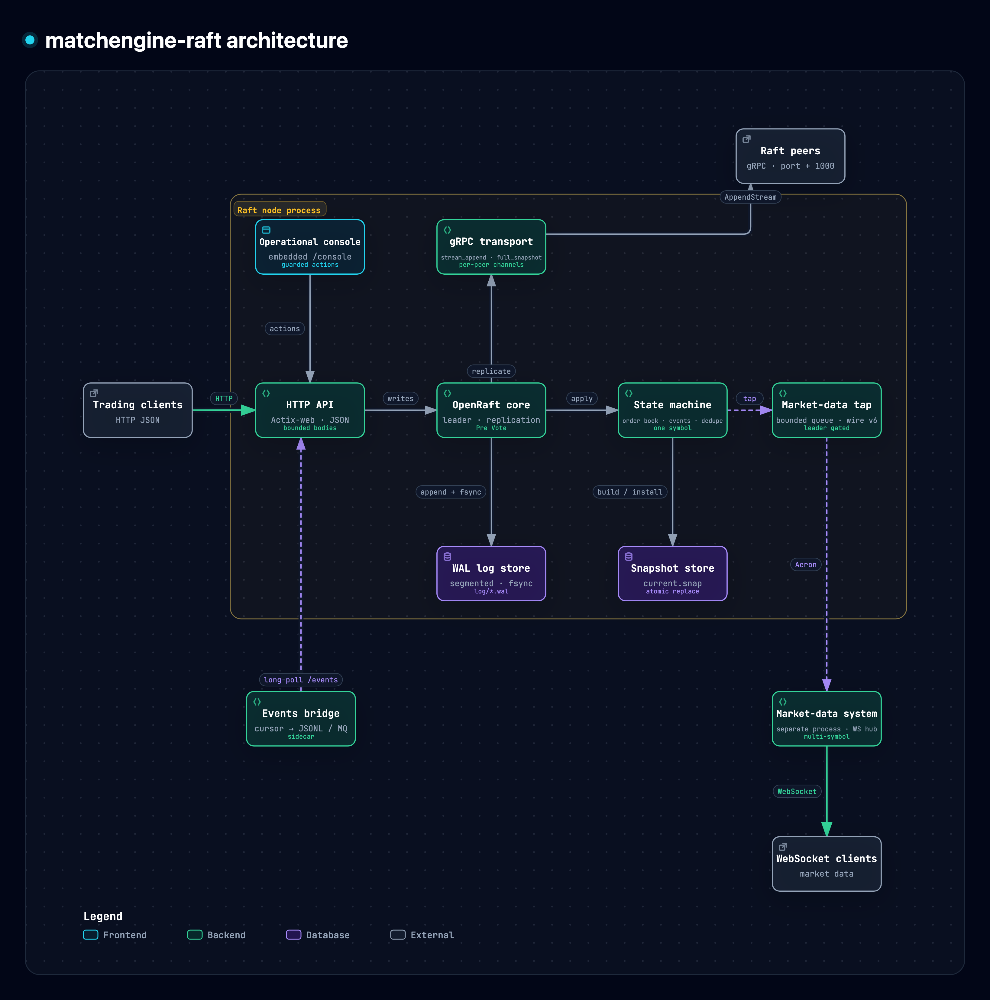
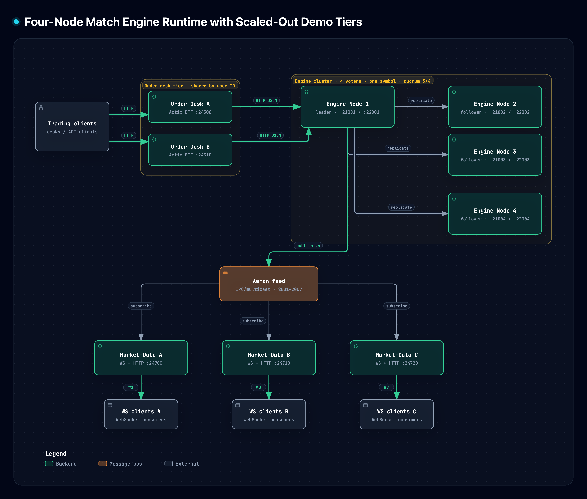
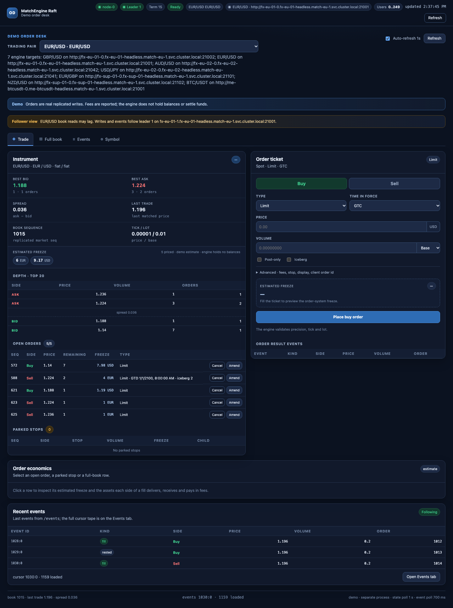
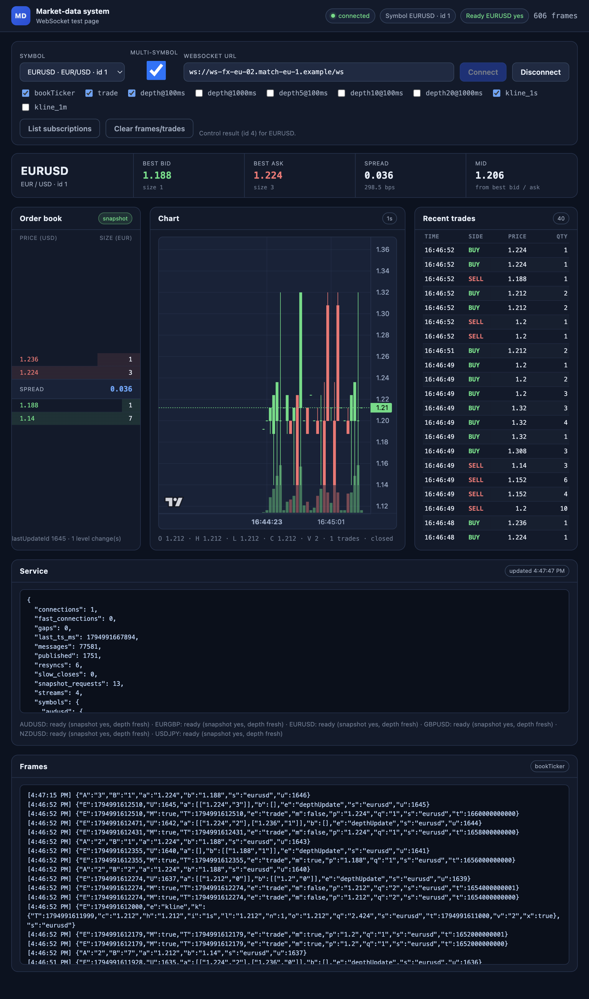
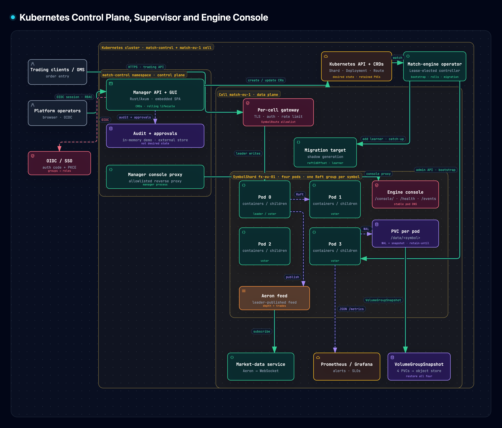
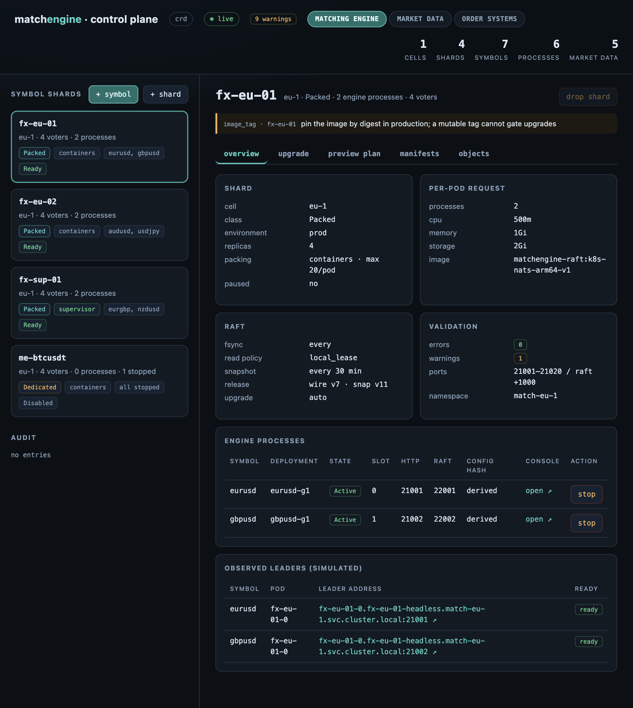

```
███╗   ███╗ █████╗ ████████╗ ██████╗██╗  ██╗███████╗███╗   ██╗ ██████╗ ██╗███╗   ██╗███████╗    ██████╗  █████╗ ███████╗████████╗
████╗ ████║██╔══██╗╚══██╔══╝██╔════╝██║  ██║██╔════╝████╗  ██║██╔════╝ ██║████╗  ██║██╔════╝    ██╔══██╗██╔══██╗██╔════╝╚══██╔══╝
██╔████╔██║███████║   ██║   ██║     ███████║█████╗  ██╔██╗ ██║██║  ███╗██║██╔██╗ ██║█████╗      ██████╔╝███████║█████╗     ██║
██║╚██╔╝██║██╔══██║   ██║   ██║     ██╔══██║██╔══╝  ██║╚██╗██║██║   ██║██║██║╚██╗██║██╔══╝      ██╔══██╗██╔══██║██╔══╝     ██║
██║ ╚═╝ ██║██║  ██║   ██║   ╚██████╗██║  ██║███████╗██║ ╚████║╚██████╔╝██║██║ ╚████║███████╗    ██║  ██║██║  ██║██║        ██║
╚═╝     ╚═╝╚═╝  ╚═╝   ╚═╝    ╚═════╝╚═╝  ╚═╝╚══════╝╚═╝  ╚═══╝ ╚═════╝ ╚═╝╚═╝  ╚═══╝╚══════╝    ╚═╝  ╚═╝╚═╝  ╚═╝╚═╝        ╚═╝
```

# ⚡ Matchengine Raft

<p align="center">
  
</p>

[](https://github.com/raymondshe/matchengine-raft/actions/workflows/ci.yml)
[](https://www.rust-lang.org)
[](./LICENSE)
[](./docs)
[](./docs/MARKET_DATA_PLAN.md)
[](./docs/STORAGE.md)

🚀 A Raft-replicated matching engine in Rust for teams that need deterministic execution,
configurable durability and a live market-data path — without treating the engine as a black box.

> 📌 **WAL durability is configurable.** `RAFT_WAL_FSYNC_MS` controls WAL fsync:
> **unset** = no fsync (default, fastest; a crash can lose acknowledged writes and the cluster
> requires at least 4 voters), **`0`** = fsync every append (strongest durability), **`N > 0`** =
> periodic fsync every N ms (bounds the loss window to roughly N ms). See
> [Storage](./docs/STORAGE.md) for the recovery contract.

**✨ Why teams pick it**

- 🎯 **Deterministic execution** — price-time matching where `apply` reads no wall clock; replaying the log reproduces the book exactly.
- 🛡️ **Configurable durability** — a hand-written segmented WAL with selectable fsync policy, atomic snapshots and snapshot + WAL-tail recovery, all exercised by restart and failure tests.
- 🧭 **Raft-native** — OpenRaft 0.10 over gRPC with Pre-Vote, leadership transfer, learner catch-up and chunked snapshot install.
- 🔢 **Exact 18-decimal fixed point** — no `f64` in the matching path; prices, quantities and fees survive the API, events, snapshots and feeds.
- 📡 **Live data, not batch** — the deterministic feed is published over Aeron (one exclusive publication per stream) and served as Binance-style WebSocket streams with 100/1000 ms depth conflation and horizontal scale-out.
- 🧰 **Operable** — embedded console, `/health` + `/ready`, metrics, replay tools and a standalone order-desk demo.
- ☸️ **Kubernetes fleet control** — a reference manager + supervisor for thousands of single-symbol engines, with zero-impact symbol lifecycle, restart guards and storage-aware shard drops.

## 🧩 Four projects, one stack

| Project | What it is | Start here |
|---|---|---|
| 🦀 **match_engine** | Raft-replicated, deterministic matching engine: order book, WAL/snapshots, gRPC Raft, event log, market-data feed and operational console | [`match_engine/README.md`](./match_engine/README.md) |
| ☸️ **k8s_control_plane** | CRD-backed manager, Lease-elected operator, renderer and GUI for single-symbol engine fleets | [`k8s_control_plane/README.md`](./k8s_control_plane/README.md) |
| 📡 **market_data_system** | Standalone Aeron/JSONL consumer serving Binance-style WebSocket market data | [`market_data_system/README.md`](./market_data_system/README.md) |
| 🧾 **order_system** | Standalone order-entry WebUI and demo freeze/settlement estimates | [`order_system/README.md`](./order_system/README.md) |

```text
.
├── match_engine/          # engine crate, benches, examples, tests, fuzz, console assets and Dockerfiles
├── k8s_control_plane/     # manager API/GUI, operator and CRDs
├── market_data_system/    # WebSocket market-data service
├── order_system/          # demo order desk
├── docs/                  # cross-project design, API, runbook and performance notes
├── scripts/               # cluster, lab and demo orchestration
└── .github/workflows/     # CI, fuzz and benchmark workflows
```

## 🏗️ Architecture

This project extends the
[example-raft-kv](https://github.com/datafuselabs/openraft/tree/main/example-raft-kv) with
persistent storage, a gRPC transport and a live market-data path. The software architecture is
shown first, followed by the runtime architecture with the four-voter engine cluster, the
order-desk tier shared by user ID, and the market-data fan-out. For an interactive, source-linked
view of the engine internals, open the
[interactive architecture diagram](./docs/matchengine-raft-architecture.html).

<p align="center"><strong>Software architecture</strong></p>

<p align="center">
  
</p>

<p align="center"><strong>Runtime architecture</strong></p>

<p align="center">
  
</p>

<p align="center"><em>Four-voter engine cluster, order-desk tier shared by user ID, and the leader-gated Aeron feed fanned out to stateless market-data instances.</em></p>

Peer-to-peer Raft RPCs use gRPC on `port + 1000`. The public application and management API stays
on the `--http-addr` listener. Raft RPCs are not part of the HTTP JSON API.

Set `RAFT_CORE_WORKERS` to a positive worker count to run OpenRaft's RaftCore and state-machine
worker on a dedicated multi-threaded runtime, isolated from the HTTP, gRPC and market-data tasks;
unset or `0` keeps Raft on the shared runtime.

Leader-consistent reads use `local_lease` by default: `/linearizable_read`, `/events`, gRPC
`StreamEvents` and `/get_linearizer` use OpenRaft's caller-side lease cache, then the core lease
path, and fall back to `ReadIndex` when the lease is stale. Set `--read-policy read_index` (or
`MATCHENGINE_READ_POLICY=read_index`) to force a fresh quorum round, or `lease` for the core path.
Lease reads require bounded clock drift between nodes; `/read` remains a local, possibly stale read.

Market-data egress is off the consensus path: the tap is a bounded `try_send`, so a slow subscriber
can never block `apply`. The feature-gated `AeronSink` publishes the same wire-v7 messages on
streams 2001–2007 from a dedicated publisher thread, with one exclusive publication per stream; the
JSONL sink remains available for debugging.

## 🧪 Features

✅ Everything below is implemented in this repository and exercised by tests.

**🧩 Matching engine**
- **Price-time priority order book** with GTC, IOC, FOK, GTD, Day, market, market-to-limit, post-only, iceberg, stop-market, stop-limit, trailing-stop and pegged orders, plus self-trade prevention.
- **Amend and cancel** with deterministic priority rules: same-price reductions keep time priority; price or size increases re-queue under a new sequence.
- **Asset-aware fee deduction** with maker/taker rates, rebates and exact notional accounting; crypto/FX default to received-asset fees, ETF/equity always settle in quote.
- **Base or quote volume** with tick/lot enforcement, quote-limit normalization and quote-budget market sweeps.
- **Exact 18-decimal fixed point** from API input through matching, events, snapshots and the market-data feed — no `f64` arithmetic in the matching path.

**🛡️ Durability and recovery**
- **Raft-replicated state machine** with durable membership and application state; WAL fsync is configurable.
- **Segmented, checksummed WAL** with `RAFT_WAL_FSYNC_MS`: unset = no fsync (default; requires at least 4 voters), `0` = every append, `N > 0` = periodic every N ms; torn-tail recovery. `--max-wal-append-bytes` (default 8 MiB) splits one apply batch into byte-bounded writes under one disk lock and one fsync.
- **Prototype async WAL** (feature-gated, off by default): `append` defers fsync to a Tokio worker and fires `IOFlushed` only when durable; includes pending-entry reads and crash-recovery tests. Build with `--features async-wal`; run with `--async-wal` and `RAFT_WAL_FSYNC_MS=0`.
- **Four-voter no-fsync floor**: `/init` and `/change-membership` reject fewer than four voters, and writes return `503` until four voters exist, so a committed entry stays on at least three nodes.
- **Atomic snapshots** written by temp file → fsync → rename → directory fsync, with checksum validation before install. Cached snapshot bytes are shared as `Arc<[u8]>`, and a received snapshot streams into a validated staging file instead of an unbounded memory buffer.
- **Snapshot policy for real workloads**: every 100,000 applied entries or 30 minutes when newer entries exist, configurable with `--snapshot-interval-ms`.
- **Snapshot + WAL-tail recovery** that restores the latest snapshot, event window and idempotency map, then replays only newer log entries.
- **gRPC replication** with bidirectional `stream_append`, chunked snapshot transfer, Pre-Vote elections, leadership transfer and independent per-peer channels.

**🔌 APIs and data feeds**
- **Durable match-event feed** at `POST /events` with cursor pagination, long-poll (`wait_ms`), retention limits, `client_order_id` idempotency, gRPC `StreamEvents` streaming and a reference MQ bridge sidecar; replay-safe retries.
- **Deterministic market-data feed** with leader gating, shadow book, BBO, depth snapshots/deltas, lifecycle events, OHLC bars and a compact binary wire format with a reference decoder. The feature-gated **Aeron** egress publishes it on streams 2001–2007 with one exclusive publication per stream, an idle STATUS heartbeat and a stream-2010 snapshot-request path.
- **Standalone market-data system** at [`market_data_system/`](./market_data_system/): consumes the feed over Aeron or JSONL and serves Binance-style WebSocket streams. One instance serves several symbols from a shared hub; clients hold a per-connection subscription set, switch symbols with live `UNSUBSCRIBE`/`SUBSCRIBE`, and scale horizontally without adding engine work. Late joiners request an immediate snapshot from the engine; `/ready` also expires on a missing frame/heartbeat.
- **Flexible read consistency**: local reads, linearizable leader reads with local-lease reads by default and `ReadIndex` fallback, and linearizable follower reads; `GET /read-policy/status` reports lease hits and fallbacks.
- **Local-lease reads by default**: leader-consistent reads use OpenRaft's caller-side lease cache (`local_lease`) for `/linearizable_read`, `/events`, gRPC `StreamEvents` and `/get_linearizer`, falling back to the core lease path and then `ReadIndex` when the lease is stale. The 4-node benchmark measured 11-36% higher read throughput and ~40% lower 64-reader p50/p99 than the core lease path. Set `--read-policy read_index` to force a fresh quorum round, or `lease` for the core path. Lease reads require bounded clock drift (NTP/PTP).
- **Leader-aware Rust client** that tracks and forwards requests to the current leader, with configurable timeouts, transient retry/backoff and typed API/no-leader errors; retries are at-least-once, so use `client_order_id` for idempotent write retries.
- **Operational APIs** for initialization, membership changes, metrics, event status and market-data status.
- **Batch writes** at `POST /write_batch`: multiple requests in one Raft entry and one WAL append, with per-request sequences and continuous event ordinals.
- **P99-aware write admission**: each node caps concurrent `/write` and `/write_batch` requests at 1,024 by default, returns `429` on overflow, and exposes current/peak/admitted/rejected counters at `/admission/status`.

**📊 Operational visibility**
- **Embedded WebUI console** at `/console/`: cluster health, Raft leadership and replication, storage/event/feed state, a leader-only event viewer and diagnostics — no build step or external assets. The applied `BASE/QUOTE` trading symbol is the page hero.
- **Guarded Raft actions**: graceful leadership transfer over the gRPC `TransferLeader` RPC, a best-effort Pre-Vote election request, and snapshot triggering, with confirmation, action locking and audit logs.
- **Standalone demo order desk** at [`order_system/`](./order_system/): a separate process and crate that places real orders and shows the full book, symbol configuration, a cursor-following `/events` tape and labelled demo estimates of the order-system freeze plus maker/taker fee settlement, with a demo-only linear perpetual/leverage overlay; reuses the console theme.
- **Health and readiness probes**: `/health` reports the gRPC listener, Raft core and WAL/state-machine frontier; `/ready` additionally requires a known leader, and `/pretrade/status` reports symbol/provisioning readiness reasons, making them suitable for orchestrators and pre-trade gates.

**☸️ Kubernetes fleet control (production shape)**
- **One control plane for thousands of single-symbol engines** — each symbol keeps its own process and four-voter Raft group; a 2,000-symbol fleet is 8,000 engine processes and, at 20 processes per pod, 100 four-pod shards (400 pods), partitioned into cells. Packing cuts pods and Kubernetes objects, not the per-symbol Raft groups.
- **Zero-impact supervisor mode** — one supervisor container per pod reads `processes.json` and starts/stops individual children; adding, stopping or starting a symbol leaves every other engine's PID, listener and data directory untouched. The OrbStack validation kept all pod UIDs and restart counts unchanged while adding and cycling children.
- **Explicit containers blast-radius guard** — a non-empty containers shard returns `409 restart_required`; `allowRestart` opts into a one-voter-at-a-time pod roll, so a routine add cannot silently restart the fleet.
- **Complete lifecycle with storage decisions** — graceful shutdown/start reuses the same deployment, slot/ports and PVC and recovers WAL/snapshot without a new `/init`; an idle shard can be dropped with `retainStorage` keeping the PVCs for restore or deleting them irreversibly.
- **CRD-backed desired state** — five `matching.io` CRDs (`TradingSymbol`, `SymbolShard`, `SymbolDeployment`, `SymbolRoute`, `Cell`) with status subresources; the manager writes through the Kubernetes API server, rebuilds its cache from informers, uses `resourceVersion` concurrency and rate-limits status writes. etcd persists the CRs; the manager never connects to etcd directly, and engine WAL/events never go there.
- **Lease-elected cell operator** — watches the CRDs, server-side-applies/prunes the StatefulSet/Services/PDB/NetworkPolicy/ConfigMap, labels the dedicated-shard leader for the leader Service, and writes shard/deployment/route/symbol status and conditions. Watches trigger immediate reconciliation; a Kubernetes Lease serializes replicas.
- **Desired-state manager, not a hand-run YAML pile** — catalog validation, lowest-free slot and `httpBasePort + slot` allocation, rendered StatefulSet/Services/PDB/NetworkPolicy/ConfigMap, reconcile bootstrap/upgrade plans, audit and an engine-console proxy across many shards and cells.
- **Production Kubernetes primitives** — four-voter shards, one PVC per pod, PDB, NetworkPolicy, headless gRPC services, health/readiness probes, non-root images and leader-aware routing metadata. The reference manager, supervisor and Lease-elected operator are implemented here; the operator also runs bootstrap/config/membership, quorum-safe containers add/start/stop rolls, PVC retention and cross-shard cutover/rollback.

See [the Kubernetes control-plane demo](./k8s_control_plane/README.md) for the runnable
implementation and [the design](./docs/KUBERNETES_CONTROL_PLANE.md) for the production operator
contract.

**✅ Built to be trusted**
- **Bounded public edge**: request-body, read-key, event-page, idempotency-key and snapshot-size limits, with malformed input rejected before Raft.
- **Explicit internal-service contract**: loopback or trusted private networks, gateway-owned TLS/authentication, plus startup warnings for non-loopback binds.
- **Fail-fast transport health**: if the gRPC listener dies, `run()` stops the node and returns an error instead of leaving a half-healthy HTTP API serving peers that cannot reach it.
- **Correctness evidence**: randomized differential tests against a reference model, explicit order-type conformance cases, deterministic replay checks and cluster recovery tests.
- **One symbol per process/cluster** for isolated resources and failure domains; scale horizontally by running one deployment per symbol.

## 🚀 Quick start

### Run the engine

```shell
cd match_engine
cargo build --release
cargo run --release --bin matchengine-raft -- --id 1 --http-addr 127.0.0.1:21001
```

`protoc` is not required: the build script vendors it. Rust 1.89 or later is required (edition 2024).

### Start a local cluster

```shell
./scripts/test-cluster.sh
```

The script builds, starts a four-node cluster, initialises it, adds learners, changes membership
and reads the book back from every node. Use `--nodes N`, `--base-port`, `--keep`, `--no-fsync`,
`status` and `stop` to control it. See the [runbook](./docs/RUNBOOK.md) for manual startup,
membership changes, failure drills and recovery.

### Run the demos

```shell
./scripts/demo-pair.sh             # two engines + order desk
./scripts/market-data-system.sh    # two engines + market-data WebSocket service
```

## 🧾 Demo order desk

[`order_system/`](./order_system/) is a standalone order-entry WebUI for a running node. It is a
separate crate and process; the engine binary and its routes are unchanged. It calls the public HTTP
API through the leader-aware client and reuses the console theme.

```shell
cargo run --manifest-path order_system/Cargo.toml -- \
  --addr 127.0.0.1:24300 --engine 127.0.0.1:24301 --engine-id 1
```

Open <http://127.0.0.1:24300/demo/>. Tabs cover the order ticket, the full order book, the
`/events` cursor tape and symbol configuration.



See [`order_system/README.md`](./order_system/README.md) for the demo flow and
[`docs/DEMO_ORDER_SYSTEM.md`](./docs/DEMO_ORDER_SYSTEM.md) for the design.

## 📡 Market-data system over Aeron

[`market_data_system/`](./market_data_system/) is the live distribution tier. The engine publishes
its deterministic feed through the feature-gated `AeronSink` on streams 2001–2007; one exclusive
publication per stream and a dedicated publisher thread keep a large depth snapshot from
head-of-line-blocking trades. Aeron multicast fans the same bytes out to any number of stateless
service instances, so the engine's publish cost is independent of WebSocket clients.

The service keeps a shadow book per symbol, conflates diff depth at 100/1000 ms, pushes a snapshot
on subscribe, serializes each stream message once and fans it out through bounded per-connection
queues. The test page uses one WebSocket and switches symbols with live `UNSUBSCRIBE`/`SUBSCRIBE`:



**Why it is fast and live-safe**

- `apply` never waits on a subscriber: the tap is a bounded `try_send`, and a full queue drops frames and emits `GAP` while consensus continues.
- One exclusive Aeron publication per stream; a depth snapshot cannot block a trade or status stream.
- One JSON encode per stream message, shared as `Bytes` across every subscriber.
- An idle STATUS heartbeat keeps `@status` alive when the book is quiet; a late joiner can request an immediate reset snapshot on stream 2010 instead of waiting for the periodic broadcast.
- 100/1000 ms depth conflation and latest-value collapse for `bookTicker` and partial depth, so bursts do not multiply socket writes.
- Deterministic `(symbol_id, stream_id, market_seq, sub_seq)` keys make failover, restart and multi-instance fan-out content-identical.
- Stateless instances rebuild from a periodic reset snapshot plus deltas and scale horizontally behind a load balancer.
- The feed path is load-tested at 500k fills/s (495k fills/s, zero drops at the 8,192-frame tap queue).

Run it with `./scripts/market-data-system.sh` (two engines over Aeron IPC) and open
<http://127.0.0.1:24800/>. For the Linux external-driver and multicast validation, run
`./scripts/aeron-linux-lab.sh`. See [`market_data_system/README.md`](./market_data_system/README.md)
and [`docs/MARKET_DATA_WEBSOCKET.md`](./docs/MARKET_DATA_WEBSOCKET.md).

## ☸️ Kubernetes control plane

The engine trades one symbol per process, so a multi-symbol deployment is a fleet of independent
Raft clusters. [`k8s_control_plane/`](./k8s_control_plane/) is the reference control plane: it
models four-pod `SymbolShard`s that pack several single-symbol engine processes per pod, validates
placement and ports, renders the StatefulSet/Services/PDB/NetworkPolicy set, and plans bootstrap,
membership, routing and same-version upgrades. The manager API/GUI owns the symbol catalog, RBAC,
approvals and the allowlisted engine-console proxy. It can reserve empty shards, place a new symbol
into a reserved or existing shard with the next free slot/port, and prepare a shadow migration plan
for an existing symbol. Supervisor-mode shards add a symbol by changing only the ConfigMap, so
existing engine processes keep running; containers-mode additions require an explicit restart
opt-in.

The same control plane supports graceful shutdown and start of one symbol, retaining its slot,
ports and PVC and recovering its WAL/snapshot without a new `/init`. An idle shard can be dropped
with an explicit choice to keep the PVCs for a later restore or delete them irreversibly. Desired
state can use the JSON demo store or the CRD backend, which writes the five `matching.io` CRDs
through the Kubernetes API server (etcd underneath) and refreshes its cache from informers. A
Lease-elected operator watches the CRDs, applies/prunes the rendered workloads, labels dedicated
leader pods, writes shard/deployment/route status, bootstraps/configures each Raft group, rolls
containers one pod at a time behind a quorum gate, applies PVC retention windows and performs
cross-shard cutover/rollback with a distinct Raft ID range. The architecture scales to thousands
of single-symbol engines and their four-voter process instances across shards and cells.

[](./docs/kubernetes-console-architecture.html)

[Open the interactive diagram](./docs/kubernetes-console-architecture.html) ·
[Design and CRDs](./docs/KUBERNETES_CONTROL_PLANE.md) ·
[etcd storage](./docs/ETCD_STORAGE.md) ·
[Local test plan](./docs/KUBERNETES_LOCAL_TESTING.md) ·
[Reference demo](./k8s_control_plane/README.md)



The manager GUI: shard catalog, supervisor/containers packing modes, validation, reconcile plan,
manifests, audit and engine-console links. The selected `fx-sup-01` shard is supervisor-mode and
hosts `eurgbp` and `nzdusd`; both were added without restarting the running engines.

## 🔒 Security and deployment boundary

The HTTP API and the gRPC Raft listener (HTTP port + 1000) are **plaintext and unauthenticated by
design**. This is an internal matching engine, not an internet-facing gateway: run it only on
loopback or a trusted private network, firewall both ports, and terminate TLS plus client
authentication at the gateway in front of it. TLS/mTLS and API authentication are intentionally
not implemented in this process, where they would add latency without protecting a public surface.

The node logs a warning when it is bound to a non-loopback address. Request handling is bounded at
the edge, before Raft proposes anything:

| Surface | Limit |
|---|---|
| Application/management JSON bodies | 1 MiB (`MAX_REQUEST_BODY_BYTES`) |
| `client_order_id` | 1–128 bytes, ASCII letters/digits plus `. _ - :`; empty rejected |
| `/read` key | 1–128 printable ASCII bytes |
| `/events` page size | 1–1000 events |
| `/events` long-poll wait | 0–1000 ms (`wait_ms`) |
| `/write_batch` | 1–128 non-nested requests, unique `client_order_id`s |
| gRPC Raft message | 64 MiB (`MAX_MESSAGE_SIZE`) |
| gRPC snapshot stream | 256 MiB total (`MAX_SNAPSHOT_BYTES`), checked before each chunk is staged |

Malformed JSON and invalid fields return `400`; oversized bodies return `413`. The replicated
`client_order_id` dedupe map retains at most 262,144 records, so the key bound also bounds its
memory.

## 📊 Performance

Headline numbers from the reference machine (Apple M4, Rust 1.93.1, release bench profile). Book-only
rows exclude HTTP, Raft and WAL; replicated rows use four in-process loopback voters with WAL fsync
disabled. Methodology, percentiles, durability modes and caveats are in
[`docs/PERFORMANCE.md`](./docs/PERFORMANCE.md).

| Workload | Result |
|---|---:|
| Order-book deep sweep (100 levels) | 11.66M fills/s |
| Order-book deep cancels | 19.63M cancels/s |
| BBO advance / BBO query | 20.37M advances/s / 434.5M queries/s |
| Realistic mixed replay (add/cancel/amend/stop/iceberg/taker) | 968,709 ops/s |
| Replicated writes, 512 in flight (pre-connected) | 114,484 writes/s, p99 5.76 ms |
| Replicated writes, 1,024 in flight (pre-connected) | 99,330 writes/s, p99 8.74 ms |
| Replicated sequential 128-order batches | 227,319 orders/s |
| Replicated 100 x 32 concurrent batches | 216,163 orders/s |
| Local-lease linearizable reads (1 / 64 readers) | 27,357 / 56,924 reads/s; p50 34.8 / 53.5 µs |
| Local-lease follower reads (1 / 64 readers) | 12,564 / 39,473 reads/s; p50 78.4 / 198.1 µs |
| Local-lease event reads (1 / 64 readers) | 8,224 / 45,243 reads/s; p50 118.8 µs / 1.34 ms |
| Market-data feed (null sink) | 495k fills/s, 0 drops at an 8,192-frame queue |
| WAL append / read, no fsync (storage-only) | 2.15M / 5.66M entries/s |

Book-only figures are best-case single-process order-book numbers, not end-to-end capacity. The four-node
rows use a 3-of-4 quorum on loopback with all nodes in one process; they do not model cross-host
network latency, independent disk contention or host failure. Pre-connected writes plateau at
512–1,024 in flight; the earlier connection-storm sweep included TCP setup and understated
capacity. Every-append durability is much lower on the single-node sequential path (262 writes/s)
but still reaches 180k orders/s for 100 x 32 batches on one node; see PERFORMANCE.md for that
trade-off.

**Recommended production profile.** For maximum throughput, leave `RAFT_WAL_FSYNC_MS` unset
(default; requires at least four voters), keep `RAFT_CORE_WORKERS` unset and the OpenRaft
`300/1/0` defaults, and use `/write_batch` with 32–128 orders. The server caps concurrent
`/write` and `/write_batch` requests at 1,024 per node by default; excess requests receive `429`
and should be retried with backoff. Lower `--max-inflight-writes` to `512` for a tighter tail at
roughly 1,024 concurrent clients, or set it to `0` to disable rejection; tune the value against
the deployment load. Keep the default local-lease reads only when NTP/PTP keeps clock drift bounded;
otherwise set `--read-policy read_index`.
If acknowledged writes must survive an unclean crash, set `RAFT_WAL_FSYNC_MS=0` and batch writes
to amortize the fsync. Do not use the 10 ms fsync mode, 1 ms batch linger, 1,024-entry
payload/purge settings, async WAL or thin LTO; none beat the defaults. See
[production configuration decisions](./docs/PERFORMANCE.md#production-configuration-decisions-2026-11-08).

WAL fsync is controlled by `RAFT_WAL_FSYNC_MS`: unset = no fsync (default; requires at least four
voters), `0` = every append, `N > 0` = periodic. See [Storage](./docs/STORAGE.md) for the durability
contract and [production decisions](./docs/PERFORMANCE.md#production-configuration-decisions-2026-11-08)
for the trade-offs.

## 📚 Documentation and testing

- [Engine README](./match_engine/README.md) — build/run, engine configuration and internals.
- [API](./docs/API.md) — HTTP application/admin routes and the gRPC Raft service.
- [Storage](./docs/STORAGE.md) — WAL, snapshots, recovery and dump tools.
- [Matching](./docs/MATCHING.md) — order types and amendment rules.
- [Match-result delivery](./docs/MATCH_RESULTS.md) — events, cursors and idempotency.
- [Testing](./docs/TESTING.md) — cluster suite, replay matrix and failure tests.
- [Performance](./docs/PERFORMANCE.md) — measured baselines and methodology.
- [Runbook](./docs/RUNBOOK.md) — cluster, upgrade, migration and recovery procedures.
- [Third-party investigations](./docs/THIRD_PARTY_INVESTIGATION.md) — external engine reviews.
- [TODO](./TODO.md) — current priorities and roadmap.

```shell
cargo test --manifest-path match_engine/Cargo.toml --locked
cargo test --manifest-path k8s_control_plane/Cargo.toml --locked
cargo test --manifest-path market_data_system/Cargo.toml --locked
cargo test --manifest-path order_system/Cargo.toml --locked
```

## 📬 Contact and credits

- Google Chat: [rshen.sy@gmail.com](https://chat.google.com/u/0/dm/rshen.sy@gmail.com)
- This project is a fork from
  [example-raft-kv](https://github.com/datafuselabs/openraft/tree/main/example-raft-kv) in the
  [OpenRaft](https://github.com/datafuselabs/openraft) project.
- Special thanks to the Databend community and Zhang Yanpo for their support.

## 📄 License

MIT — see [`LICENSE`](./LICENSE).

The project started as a fork of
[example-raft-kv](https://github.com/datafuselabs/openraft/tree/main/example-raft-kv) in the
[OpenRaft](https://github.com/datafuselabs/openraft) project, which is dual-licensed under MIT or
Apache-2.0. The original copyright and license notices continue to apply to code derived from it;
this repository is distributed under the MIT license in `LICENSE`.
